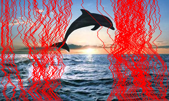

# Seam Carving

## Synopsis

In this project I'm applying computational photography technique **Seam Carving** to resize original image without losing or distorting relevant information as much as possible. This technique was first introduced in [Seam Carving for Content-Aware Image Resizing](http://graphics.cs.cmu.edu/courses/15-463/2012_fall/hw/proj3-seamcarving/imret.pdf) (Shai Avidan, Ariel Shamir) and this project is trying to reproduce results from the original paper as close as possible. 

The main goal of **Seam Carving** is to find *seam* (optimal 8-connected path of pixels on a single image from top to bottom, or left to right, where optimality is defined by an image energy function) that can be removed or added to the image to change its size without adding significant distortions at the same time.

 **->** 

 **->** 


For more detailed explanation of the reproduction results as well as assumptions made in this project see the [**Report**](report.pdf).

## Project structure
 - *helpers.py* - includes implementations of seam carving and various other helper functions  
 - *main.py* - script generating output files requires for the project
 - *out/* - output directory for main.py results
 - *test_img/* - output directory for notebook output results
 - *images/* - input files
 - *Removal.ipynb* - Jupyter notebook dedicated to figure 5 and operations related to that experiment
 - *Insertion.ipynb* - Jupyter notebook dedicated to figure 8 and operations related to that experiment
 - *Retargeting.ipynb* - Jupyter notebook dedicated to figure 7 and operations related to that experiment

## Requirements
 - Python 2.7
 - numpy library
 - OpenCV library with cv2 python library
  
## How to run
To generate output files execute in the directory of this project command:  
```
python main.py
```
In the main.py file you can comment out steps that you wish to skip in the end of the file (see comments in the end of the file).  
Also, since *fig7* step is taking a lot of time you can uncomment line in _fig7()_ function (see comments) to speed up this process, but generated output will be for smaller image.  

## Other
Project also includes several Jupyter notebook files that contain parts of main.py code in them plus additional cells showing the results at different steps.  
You can just view the notebooks of rerun them to generate more output files.

